# System Architecture & Diagrams

This document contains the structural, behavioral, and architectural diagrams for the **TravelAI** system.

## 1. ER Diagram (Entity Relationship)
Shows entities, attributes, and relationships.

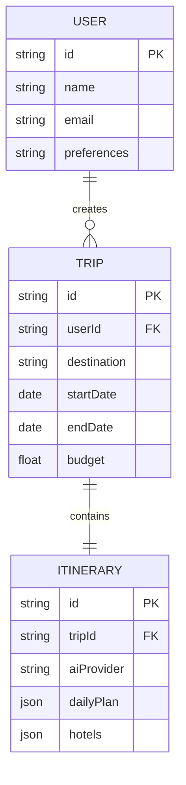

## 2. DFD Level 0 (Context Diagram)
Shows overall system data flow.

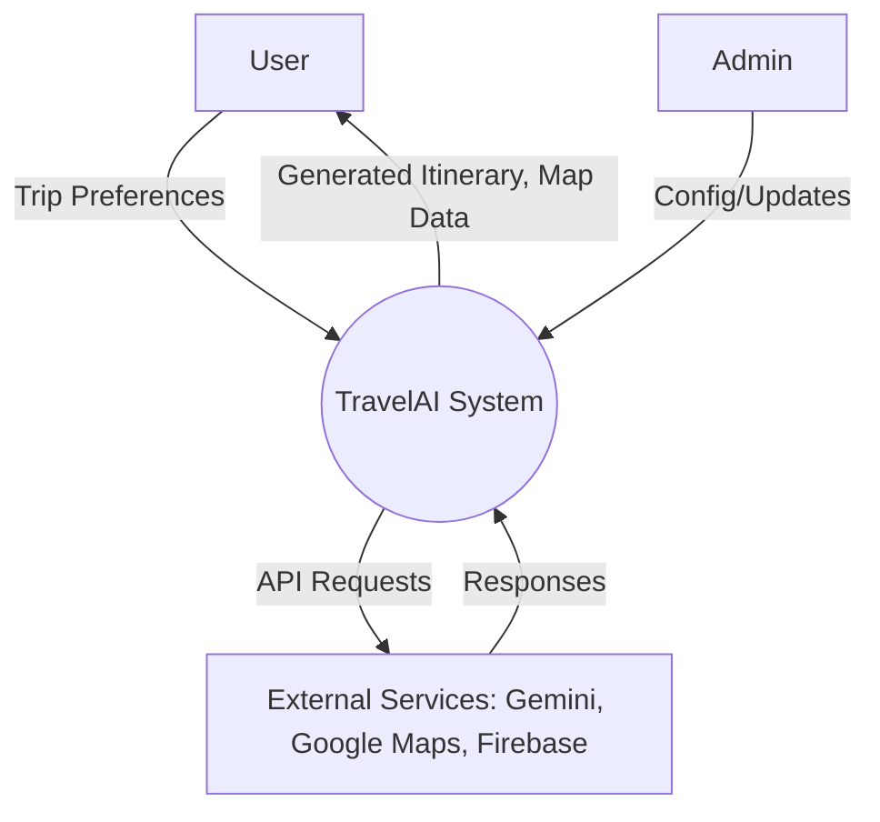

## 3. DFD Level 1
Shows detailed data flow between modules.

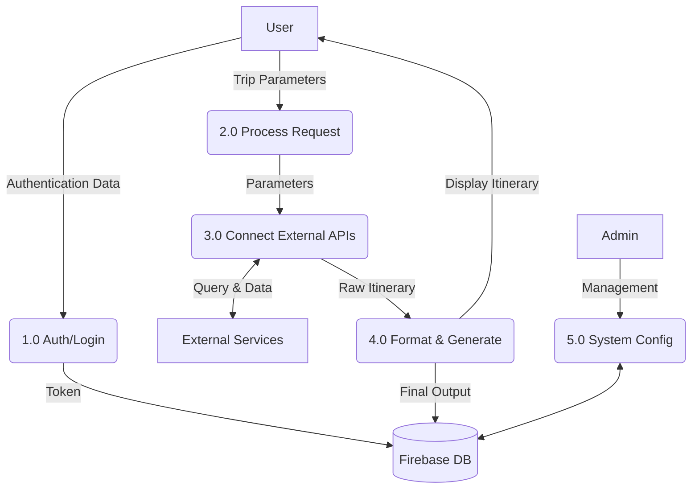

## 4. DFD Level 1.1 (Admin)
Shows admin-specific data flow.

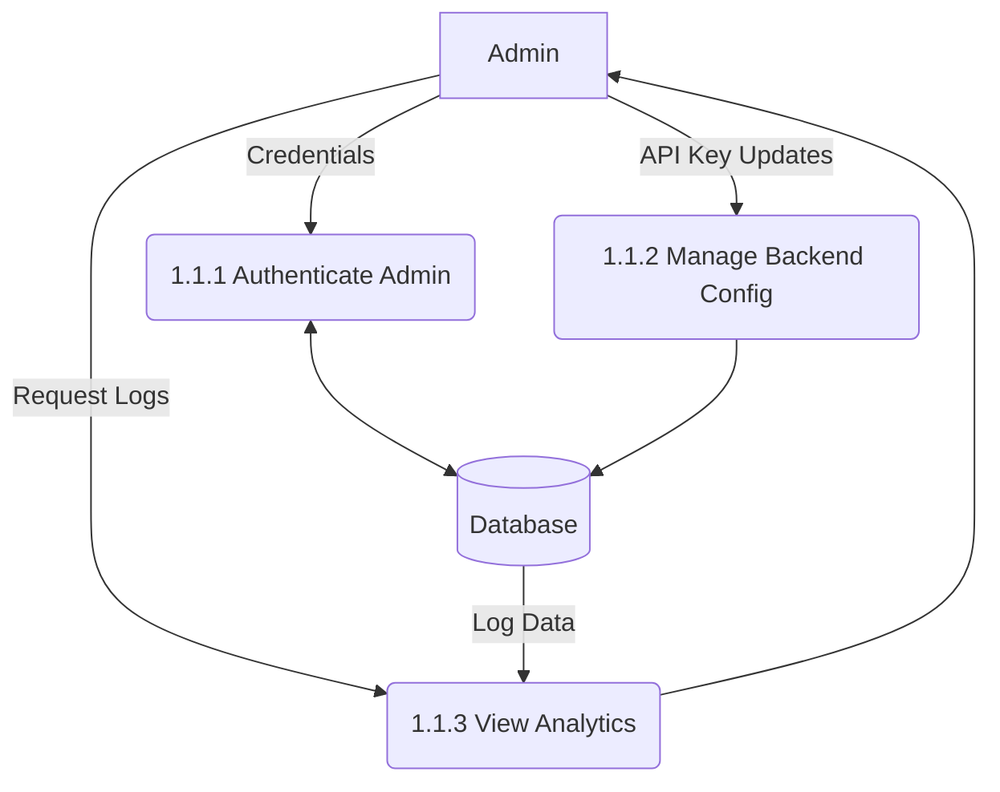

## 5. DFD Level 1.2 (User)
Shows user/customer-specific data flow.

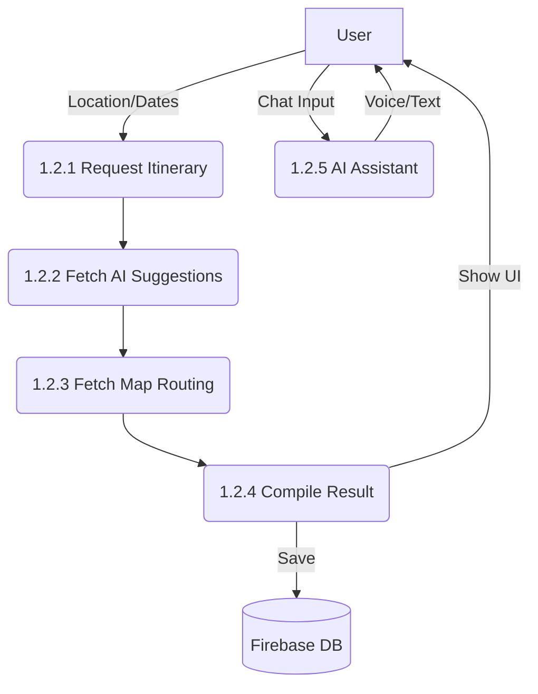

## 6. Use Case Diagram
Shows interactions between Admin and User with the system.

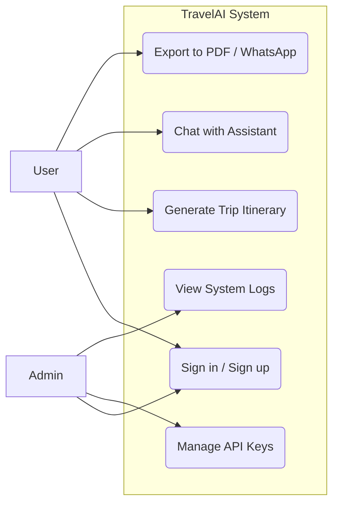

## 7. Activity Diagram (Swim Lane)
Shows flow of activities across roles.

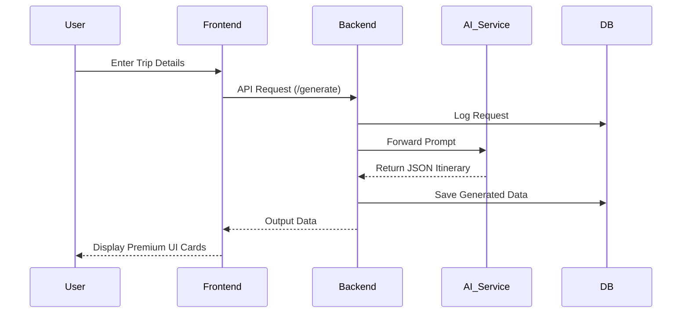

## 8. Class Diagram (UML)
Shows classes, attributes, methods, and relationships.

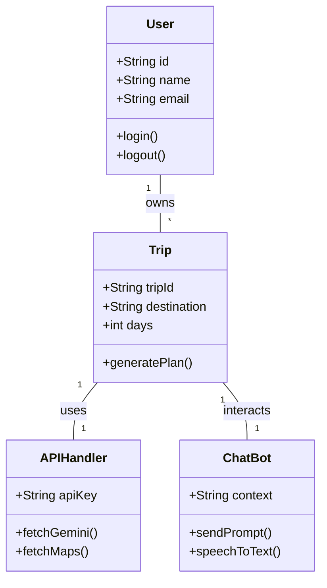

## 9. Schema Diagram
Shows database tables, primary keys, foreign keys.

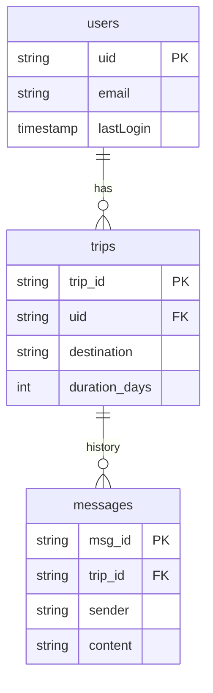

## 10. Sequence Diagram
Shows message flow between objects over time.

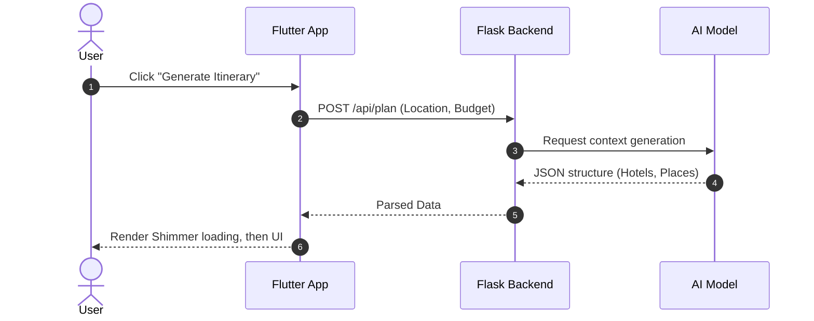

## 11. Structure Chart
Shows module hierarchy and relationships.

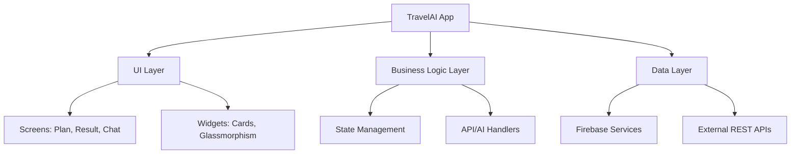

## 12. Gantt Chart
Shows project timeline and task schedule.

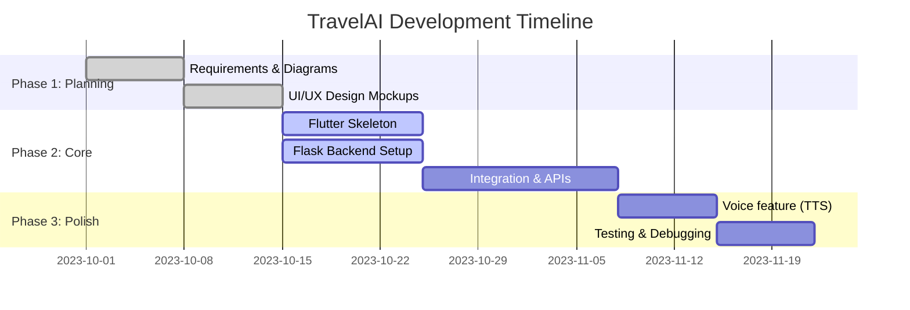

## 13. PERT Chart
Shows task dependencies and critical path.

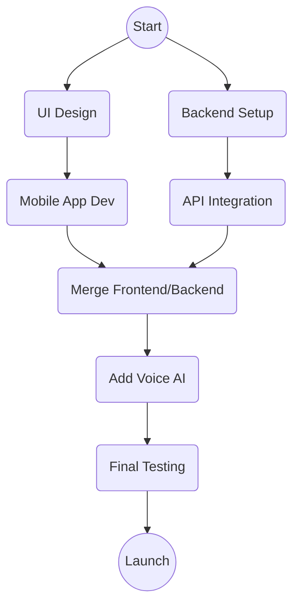
